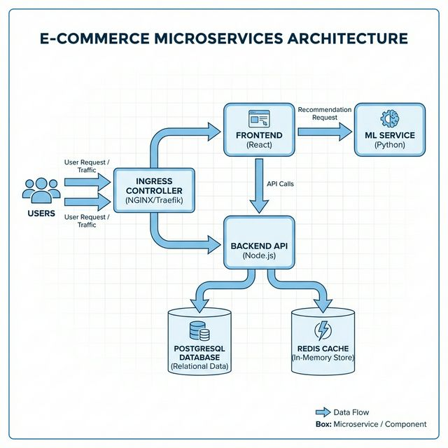

# ShopMicro - E-commerce Microservices Platform

## 1. Problem Statement and Architecture Summary
ShopMicro is a cloud-native e-commerce platform designed to demonstrate a robust DevOps and Platform Engineering toolchain. It consists of a React frontend, a Node.js backend API, a Python-based ML recommendation service, and persistent data stores using PostgreSQL and Redis. The platform is designed for high availability, observability, and automated deployment on Kubernetes.

## 2. High-Level Architecture Diagram


### Mermaid Diagram
```mermaid
graph TD
    User((User)) -->|HTTP| Ingress[Ingress Controller]
    Ingress -->|/| Frontend[Frontend (React)]
    Ingress -->|/api| Backend[Backend API (Node.js)]
    Frontend -->|/recommendations| ML[ML Service (Python)]
    Backend -->|Read/Write| DB[(PostgreSQL)]
    Backend -->|Cache| Cache[(Redis)]
```

## 3. Prerequisites
- **Docker & Docker Compose**: For local development.
- **Kubernetes Cluster**: (e.g., Minikube, Kind, or EKS) for deployment.
- **kubectl**: Configured to talk to your cluster.
- **Terraform**: For infrastructure provisioning.
- **Ansible**: For configuration management.

## 4. Local Development (Quick Start)
To run the entire stack locally using Docker Compose:

```bash
docker-compose up --build
```
Access the application at `http://localhost:3000`.

## 5. Deployment Commands
To deploy to a Kubernetes cluster:

1. **Create Namespace**
   ```bash
   kubectl apply -f k8s/namespace.yaml
   ```

2. **Deploy Data Layer (Postgres & Redis)**
   ```bash
   kubectl apply -f k8s/redis.yaml
   kubectl apply -f k8s/postgres.yaml
   ```

3. **Deploy Microservices**
   ```bash
   kubectl apply -f k8s/backend.yaml
   kubectl apply -f k8s/ml-service.yaml
   kubectl apply -f k8s/frontend.yaml
   ```

4. **Setup Ingress**
   ```bash
   kubectl apply -f k8s/ingress.yaml
   ```

## 6. Observability
(Placeholder for actual observability setup)
- **Metrics**: Accessed via `/metrics` endpoints.
- **Logging**: stdout/stderr logs aggregated by the container runtime.

## 7. Security Controls
- **Secrets Management**: Database credentials should be managed via Kubernetes Secrets (not committed to git).
- **Network Policies**: Ingress provides a single entry point.

## 8. Backup & Restore
- **Postgres**: Use `pg_dump` on the postgres container for snapshots.

## 9. Known Limitations
- This is a starter implementation. Production setup requires real secrets management (Vault/AWS Secrets Manager), full CI/CD pipelines, and comprehensive monitoring.
