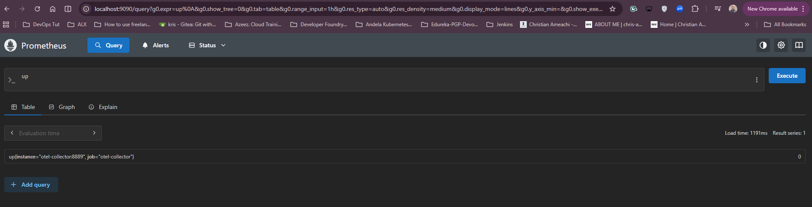

## **Task Documentation**

This Document shows step-by-step task done with screenshot

### **Infrastructure Provisioning (Terraform)**

### Prerequisites

I already have the following:
- **AWS Account**
- **AWS CLI installed in my local machine. Run to check:** `aws --version`
- **Terraform installed in my local machine. Run to check:** `terraform version`


**In my AWS Account, I created an access key and secret key for terraform to use.**


**Then I configure the aws cli to use the access key and secret key.**

`aws configure`


### Steps

1. Goto the terraform folder and Initialize Terraform

```bash
cd infrastructure/terraform
terraform init
```


2. **Apply Terraform `terraform apply`**


## Configuration setup (Ansible)

### Prerequisites

I already have the following:

- **Ansible installed in my local machine via wsl. Run to check:** `ansible --version`


### Steps

**1. Goto the ansible folder and update the inventory file `cd infrastructure/ansible`**


**Create a playbook to setup kubernetes cluster on the EC2 instances.**

```
---
- name: Kubernetes Common Configuration
  hosts: all
  become: yes
  tasks:
    - name: Disable swap
      shell: |
        swapoff -a
        sed -i '/ swap / s/^/#/' /etc/fstab

    - name: Load kernel modules
      copy:
        content: |
          overlay
          br_netfilter
        dest: /etc/modules-load.d/k8s.conf

    - name: Modprobe modules
      shell: |
        modprobe overlay
        modprobe br_netfilter

    - name: Apply sysctl params
      copy:
        content: |
          net.bridge.bridge-nf-call-iptables  = 1
          net.bridge.bridge-nf-call-ip6tables = 1
          net.ipv4.ip_forward                 = 1
        dest: /etc/sysctl.d/k8s.conf

    - name: Apply sysctl
      command: sysctl --system

    - name: Install dependencies
      apt:
        name:
          - ca-certificates
          - curl
          - gnupg
          - lsb-release
          - apt-transport-https 
        state: present
        update_cache: yes

    - name: Add Docker GPG key
      shell: |
        mkdir -p /etc/apt/keyrings
        curl -fsSL https://download.docker.com/linux/ubuntu/gpg | gpg --dearmor -o /etc/apt/keyrings/docker.gpg --yes
        chmod a+r /etc/apt/keyrings/docker.gpg

    - name: Add Docker repository
      shell: |
        echo "deb [arch=$(dpkg --print-architecture) signed-by=/etc/apt/keyrings/docker.gpg] https://download.docker.com/linux/ubuntu $(lsb_release -cs) stable" | tee /etc/apt/sources.list.d/docker.list > /dev/null

    - name: Install containerd
      apt:
        name: containerd.io
        state: present
        update_cache: yes

    - name: Configure containerd
      shell: |
        mkdir -p /etc/containerd
        containerd config default | tee /etc/containerd/config.toml
        sed -i 's/SystemdCgroup = false/SystemdCgroup = true/' /etc/containerd/config.toml
      notify: restart containerd

    - name: Add Kubernetes GPG key
      shell: |
        curl -fsSL https://pkgs.k8s.io/core:/stable:/v1.30/deb/Release.key | gpg --dearmor -o /etc/apt/keyrings/kubernetes-apt-keyring.gpg --yes

    - name: Add Kubernetes repository
      shell: |
        echo 'deb [signed-by=/etc/apt/keyrings/kubernetes-apt-keyring.gpg] https://pkgs.k8s.io/core:/stable:/v1.30/deb/ /' | tee /etc/apt/sources.list.d/kubernetes.list

    - name: Install Kubernetes components
      apt:
        name:
          - kubelet
          - kubeadm
          - kubectl
        state: present
        update_cache: yes

    - name: Hold Kubernetes packages
      shell: apt-mark hold kubelet kubeadm kubectl

  handlers:
    - name: restart containerd
      service:
        name: containerd
        state: restarted
        enabled: yes

- name: Master Node Setup
  hosts: masters
  become: yes
  tasks:
    - name: Initialize Kubernetes Control Plane
      command: kubeadm init --pod-network-cidr=192.168.0.0/16
      register: kubeadm_output
      ignore_errors: yes # Ignore if already initialized

    - name: Setup kubeconfig for ubuntu user
      shell: |
        mkdir -p /home/ubuntu/.kube
        cp /etc/kubernetes/admin.conf /home/ubuntu/.kube/config
        chown $(id -u ubuntu):$(id -g ubuntu) /home/ubuntu/.kube/config

    - name: Install Calico Network Plugin
      command: kubectl apply -f https://docs.projectcalico.org/manifests/calico.yaml --kubeconfig=/etc/kubernetes/admin.conf

    - name: Generate join command
      command: kubeadm token create --print-join-command
      register: join_command_raw

    - name: Set join command fact
      set_fact:
        join_command: "{{ join_command_raw.stdout }}"

    - name: Save join command to local file (for debugging/reference)
      local_action: copy content="{{ join_command_raw.stdout }}" dest=./join_command.sh
      become: no

    - name: Add dummy host to store join command for workers
      add_host:
        name: "K8S_TOKEN_HOLDER"
        join_command: "{{ join_command_raw.stdout }}"

- name: Worker Node Setup
  hosts: workers
  become: yes
  tasks:
    - name: Join Cluster
      shell: "{{ hostvars['K8S_TOKEN_HOLDER']['join_command'] }}"
      args:
        executable: /bin/bash
      when: hostvars['K8S_TOKEN_HOLDER'] is defined
```

**2. Run the playbook `ANSIBLE_HOST_KEY_CHECKING=False ansible-playbook -i inventory.ini playbook.yml`**


**3. Check the status of the cluster created in ec2 `kubectl get nodes`**


**NOTE: I terminate the EC2 instance and use AWS EKS Cluster**

**4. AWS EKS Cluster**


On my GitHub, I created a repository named ShopMicro-Production and added my kube congig data and AWS access key and secret key as secrets in the repository settings.

On ks8 master node i run `cat ~/.kube/config` to get the kube config data and paste it in the repository settings secrets.


## CI/CD Pipeline Implementation
I implemented a complete GitHub Actions workflow suite:

- **ci.yml:**

Triggers on Push/PR. Runs linting (Node/Python), Unit Tests, and builds/pushes Docker images to GHCR.


- **cd.yml:**

Triggers after CI success on main. Deploys the application to my Kubernetes cluster.


`kubectl get pod -n shopmicro` to check running pod on cluster


- **iac-ci.yml:**

Runs terraform fmt, terraform validate, tflint, and OPA policy checks on infrastructure changes.

- **drift-detection.yml:**

Runs daily at 8am to check for infrastructure drift. Status: ✅ Implemented. Requires Secrets setup in GitHub.


## **Configure ingress**

**Install NGINX Ingress Controller:**

The Ingress resource **(k8s/ingress.yaml)** requires a controller to work. Install it on EKS

`kubectl apply -f https://raw.githubusercontent.com/kubernetes/ingress-nginx/main/deploy/static/provider/aws/deploy.yaml`

confirm: `kubectl get pods -n ingress-nginx`


**Apply Ingress Resource: Apply the ingress.yaml file to expose the application externally.**

confirm: `kubectl get ingress -n shopmicro`


**Test the frontend is working through ingress:**

`curl -H "Host: shopmicro.local" http://a8d8611eb84e74f7f883a0297dd32158-ebd7925954c29321.elb.eu-west-2.amazonaws.com`


**Test the backend is working through ingress**

`curl -H "Host: shopmicro.local" http://a8d8611eb84e74f7f883a0297dd32158-ebd7925954c29321.elb.eu-west-2.amazonaws.com/api/health`


## **Horizontal Pod Auto Scaling**: 

The HPA is now deployed. Check its status (requires `metrics-server`):

NOTE: if the cpu, or memory threshold is reached, pod will automatically scaled till it get to its set maxpods

```
kubectl get hpa -n shopmicro
```


## **Monitoring (Prometheus & Grafana)**

Using portforwarding to test prometheus and grafan access on the web, given that their services are clusterIP and can only be access internally

**Portforward prometheus: `kubectl port-forward svc/prometheus 9090:9090 -n shopmicro`**

On browser: http://localhost:9090



**Portforward grafana: `kubectl port-forward svc/grafana 3005:3000 -n shopmicro`**

On browser: http://localhost:3005


## **Rollback Proof Demonstration**

To demonstrate a successful rollback, I performed the following steps to simulate a failed deployment and recover:

1.  **Deploy a "Broken" Version**:

    Manually update the backend to use a non-existent image tag. This will trigger a rolling update that fails (ImagePullBackOff).

    ```bash
    kubectl set image deployment/backend backend=ghcr.io/amae69/shopmicro-production-backend:broken-v1 -n shopmicro
    ```

2.  **Observe the Failure**:

    Check the rollout status. You will see it hang or show errors.

    ```bash
    kubectl rollout status deployment/backend -n shopmicro
    # Pods will likely show 'ImagePullBackOff'
    kubectl get pods -n shopmicro
    ```
    **Screenshot showing "Evidence of Failure"**.

    

3.  **Perform the Rollback**:

    Use the `undo` command to revert to the last stable state.

    ```bash
    kubectl rollout undo deployment/backend -n shopmicro
    ```

4.  **Verify Restoration**:

    Confirm the deployment is back to a healthy state.

    ```bash
    kubectl rollout status deployment/backend -n shopmicro
    kubectl get pods -n shopmicro
    ```
    **Screenshot showing "Rollback Proof"**.

    

    ### **END ...**
